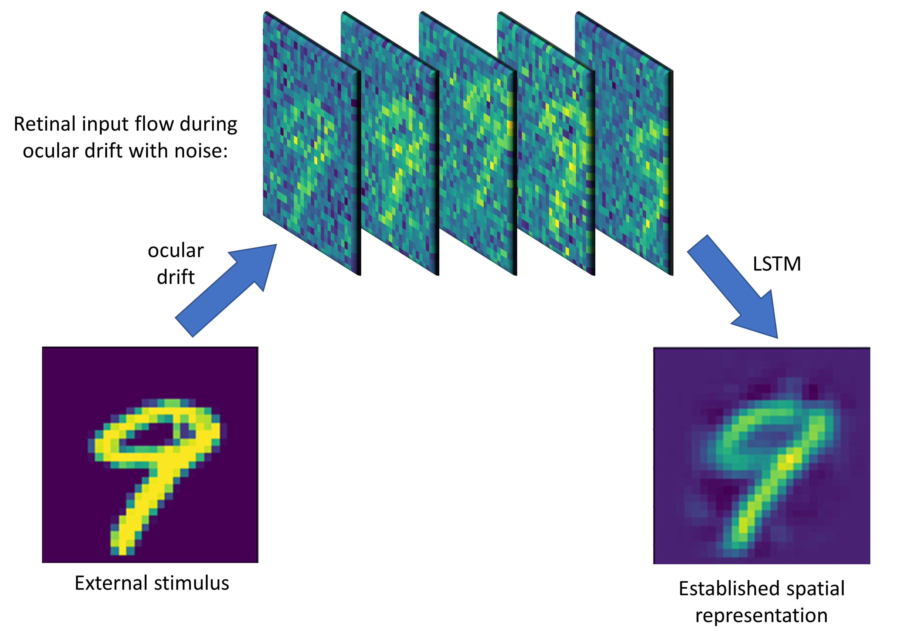

# Establishment of spatial representation from retinal input flow during ocular drift

## Introduction
Unlike the input samples fed to CNN, input of our visual system is noisy and drifting. This is because our eyes are always moving, even we try to fixate on a dot and stablized our eyes. Those slow wandering motion of eyes within a fixation is called ocular drift. The ocular drift shifts the external stimulus on the retina, transfering a static image in space into a movie on the retina. This movie is also going to be noisy given the neural noise. Despite the low-quality input, the visual system manages to gather useful information and establish a stable and precise spatial representation of the external stimulus. Here we apply deep learning algorithm to investigate this visual encoding mechanism.

## Retinal input flow generation
We took the hand-written digits in MNIST dataset as the external stimuli, and add random-walk shift to it to create every frame of retinal input flow. We also added noise to each pixel so that the model has to integrate the information across multiple frames (through time) to get a good spatial represenation of the external stimulus. For each sample in MNIST dataset, we create a random drift trajectory and transform the 2D 28x28 image to a 28x28x20 retinal input sequence (20 frames in the time axis).

## Model description
The model should take 3-dimensional retinal input flow as input and output the established spatial representation, which is a 2D image. Therefore, recurrent neural network is an ideal candidate. In this project, we tried both RNN and LSTM with 128 in dimension. The LSTM ahchieves significantly better results. Because we want to get a spatial representation of the digit, we created the fitting as regression to the orginal digits instead of classification. 

